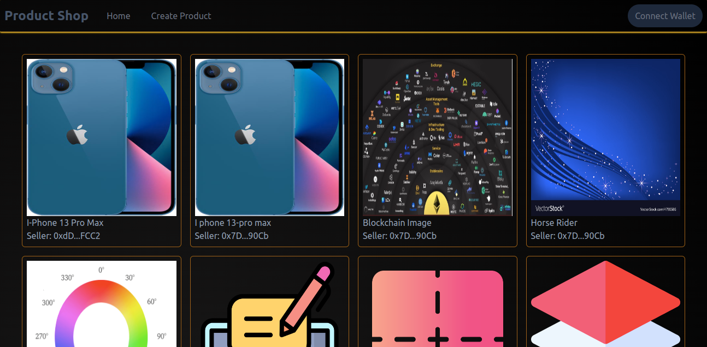
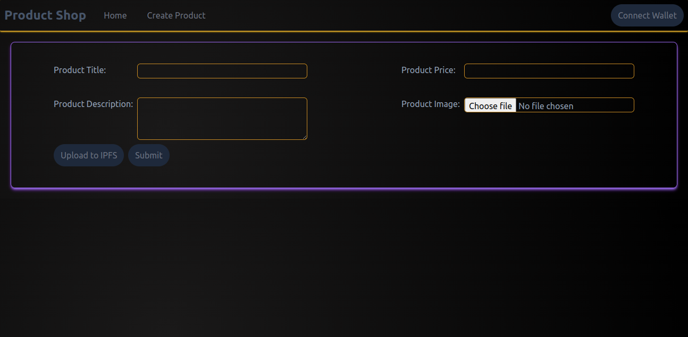
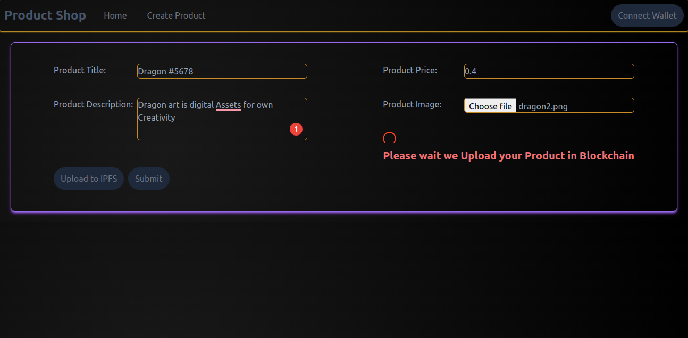
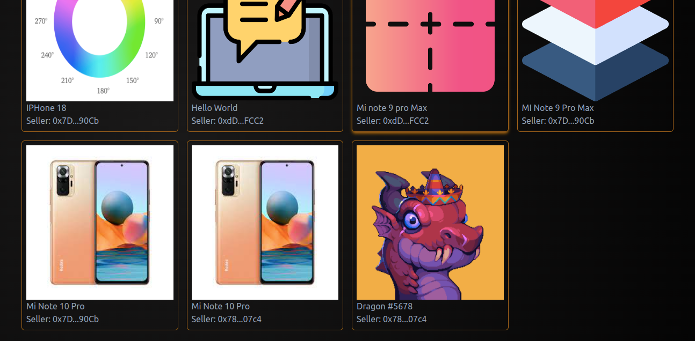
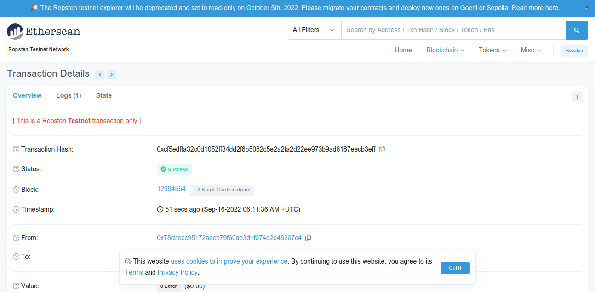

<!-- ABOUT THE PROJECT -->
# Product Shop (simple add product in blockchain and fetch data using blockchain)

A Product shop app are simple project of blockchain.Seller create product and store in blockchain and fetch product data using simple Smart Contract.

Home Page

### Built With

* [Solidity](https://docs.soliditylang.org/)
* [Hardhat](https://hardhat.org/getting-started/)
* [Next.js](https://nextjs.org/)
* [ethers.js](https://docs.ethers.io/v5/)
* [TailwindCss](https://tailwindcss.com/)

### User interface
   
The front end is built with Next JS it's framework of React.Add few ui libraries like react-toastify, react-spinners for build great User Interface.

The front-end is built using the following libraries:
      <ul>
        <li><b>Ethers.js:</b> used as interface between the UI and the deployed smart contract</li>
        <li><b>Tailwind CSS:</b> Styles using TailwindCss</li>    
      </ul>
      
The main component is Mint.js which handles the nft minting and the coundown periods : 

Create Product:

Product Store waiting (Mining in Blockchain):

Uploaded Product show in Home page:

Created Product in EtherScan (Uploaded Product)

(<a href="#top">back to top</a>)

### Prerequisites

* [nodejs](https://nodejs.org/en/download/) and [yarn](https://classic.yarnpkg.com/en/)
* [MetaMask](https://chrome.google.com/webstore/detail/metamask/nkbihfbeogaeaoehlefnkodbefgpgknn) Chrome extension installed in your browser
* [Hardhat](https://hardhat.org/) for local smart contracts deployement and testing
* [web3.storage](https://web3.storage/) account for web3 storage (free account).